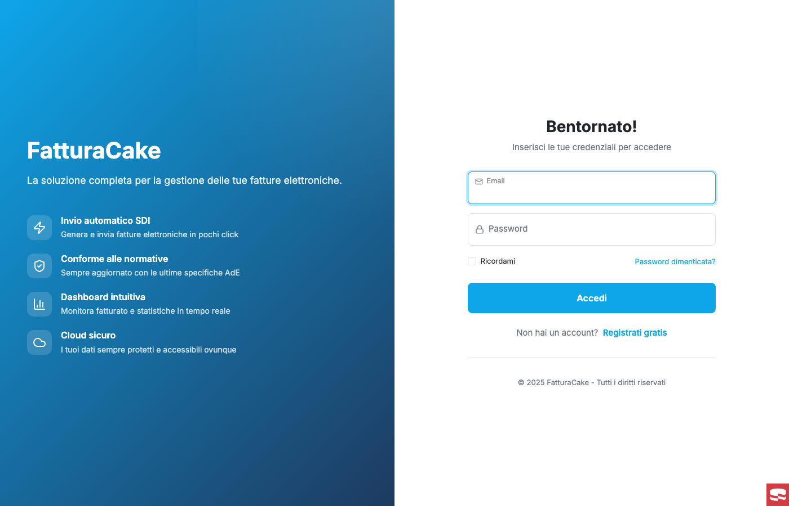
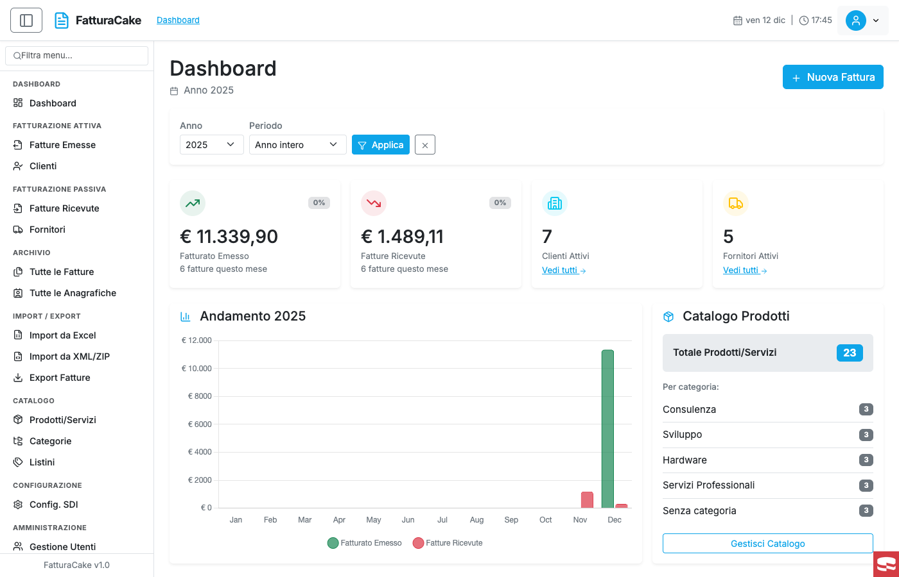
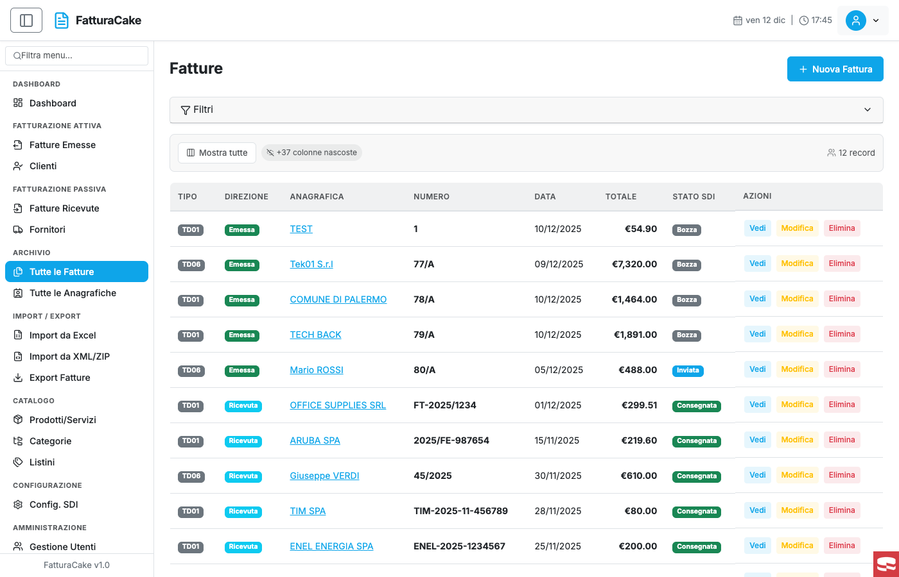
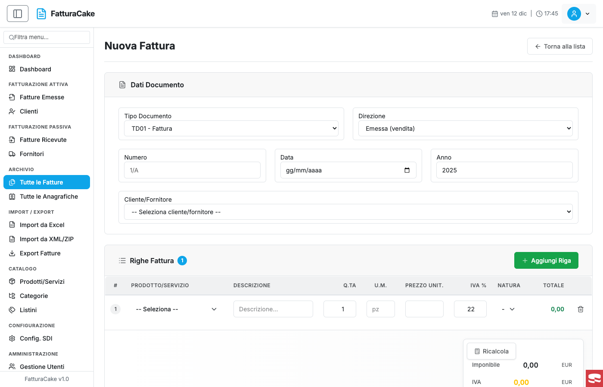
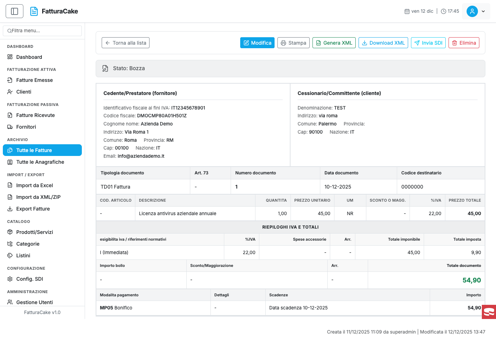
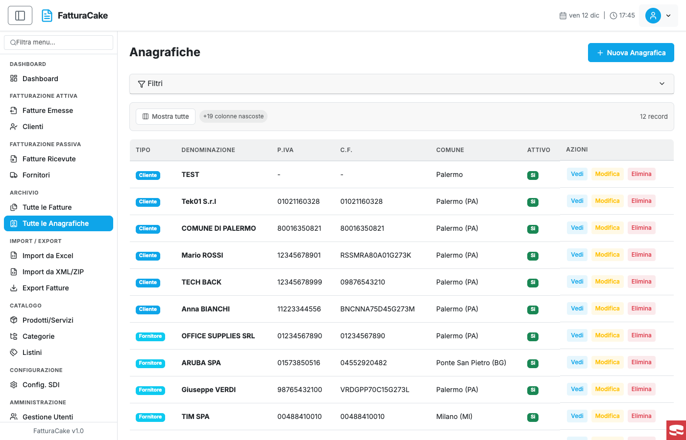
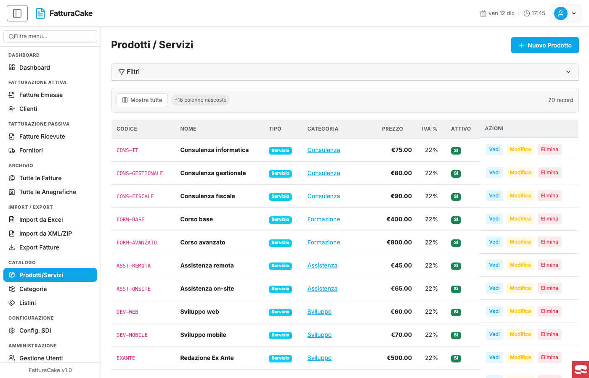
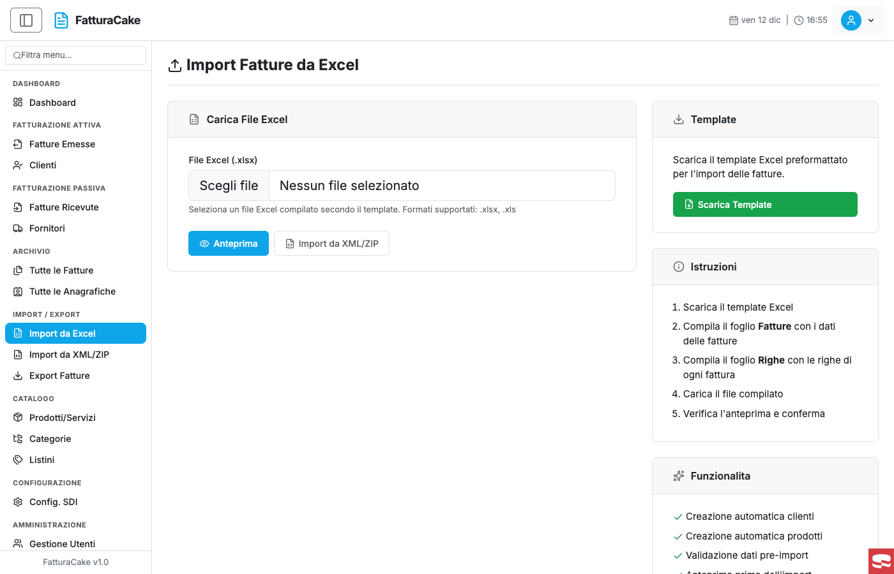

# FatturaCake

Applicazione web completa per la gestione delle fatture elettroniche (FatturaPA), sviluppata con CakePHP 5.x.

### Highlights

- **Multi-Tenant SaaS**: Architettura multi-azienda con isolamento dati completo
- **FatturaPA Compliant**: Generazione XML conforme alle specifiche Agenzia delle Entrate
- **RBAC**: Sistema di ruoli e permessi a 4 livelli (superadmin, admin, staff, user)
- **Import/Export**: Supporto Excel, XML e ZIP per import massivo
- **Dashboard Analytics**: Statistiche real-time con grafici interattivi
- **Audit Trail**: Log completo di tutte le attività utente

---

## Screenshot

| Login | Dashboard |
|:---:|:---:|
|  |  |

| Fatture Emesse | Nuova Fattura |
|:---:|:---:|
|  |  |

| Dettaglio Fattura | Anagrafiche |
|:---:|:---:|
|  |  |

| Prodotti | Import |
|:---:|:---:|
|  |  |

---

## Stack Tecnologico

| Tecnologia | Versione | Descrizione |
|------------|----------|-------------|
| **PHP** | >= 8.1 | Linguaggio backend |
| **CakePHP** | 5.2.x | Framework MVC |
| **MySQL/MariaDB** | 8.0+ | Database relazionale |
| **Bootstrap** | 5.x | Framework CSS (via BootstrapUI) |
| **Lucide Icons** | - | Icone SVG |
| **Chart.js** | 4.x | Grafici interattivi |

### Dipendenze Principali

- **cakephp/authentication**
- **cakephp/authorization**
- **cakedc/auth**
- **friendsofcake/bootstrap-ui**
- **friendsofcake/crud**
- **friendsofcake/search**
- **phpoffice/phpspreadsheet**
- **endroid/qr-code**
- **robthree/twofactorauth**
- **muffin/footprint**
- **muffin/trash**

---

## Funzionalità

### Fatturazione Elettronica
- Creazione fatture attive (emesse) e passive (ricevute)
- Generazione XML conforme al formato FatturaPA
- Integrazione con Sistema di Interscambio (SDI)
- Tracciamento stato fatture (generato, inviato, consegnato, accettato, scartato)

### Gestione Anagrafiche
- Clienti e Fornitori separati
- Dati fiscali completi (P.IVA, Codice Fiscale, Codice SDI, PEC)
- Import massivo da file

### Catalogo Prodotti
- Gestione prodotti e servizi
- Categorie prodotti
- Listini prezzi multipli
- Codici articolo e unità di misura

### Dashboard
- Panoramica fatturato emesso e ricevuto
- Grafici andamento mensile/annuale
- Filtri per periodo (mese, trimestre, semestre, anno, personalizzato)
- Statistiche clienti, fornitori e prodotti

### Import/Export
- Import fatture da XML FatturaPA
- Import anagrafiche e prodotti da Excel/CSV
- Export dati in formato Excel

### Multi-Tenant
- Supporto multi-azienda
- Isolamento dati per tenant
- Gestione piani e abbonamenti

### Sicurezza
- Autenticazione con email/password
- Autenticazione a due fattori (2FA) con Google Authenticator
- Sistema di ruoli e permessi granulare
- Log attività utente

---

## Requisiti
- PHP >= 8.1
- MySQL >= 8.0 o MariaDB >= 10.4
- Composer
- Estensioni PHP: intl, mbstring, openssl, pdo_mysql

---

## Open Source

Questo progetto e rilasciato come **open source** sotto licenza MIT. Sei libero di:

- **Usarlo** per progetti personali o commerciali
- **Forkarlo** per personalizzarlo secondo le tue esigenze
- **Contribuire** con nuove funzionalita o bug fix

### Come Contribuire

1. **Fork** il repository
2. Crea un **branch** per la tua feature (`git checkout -b feature/nuova-funzionalita`)
3. **Committa** le modifiche (`git commit -m 'Aggiunge nuova funzionalita'`)
4. **Pusha** il branch (`git push origin feature/nuova-funzionalita`)
5. Apri una **Merge Request** (MR)

### Idee per Contributi

- Integrazione completa con SDI (Sistema di Interscambio)
- Notifiche email per stato fatture
- API REST per integrazioni esterne
- Dashboard analytics avanzate
- Supporto multi-lingua
- App mobile (React Native / Flutter)

### Fork e Personalizzazione

Sentiti libero di fare un fork e personalizzare FatturaCake per le tue esigenze specifiche. Il codice e strutturato per essere facilmente estendibile:

- Aggiungi nuovi **Controller** in `src/Controller/`
- Estendi i **Model** in `src/Model/Table/`
- Crea nuovi **Service** in `src/Service/`
- Personalizza i **Template** in `templates/`

---

## Licenza

MIT License - vedi [LICENSE](LICENSE) per i dettagli.

Copyright (c) 2025 - FatturaCake
